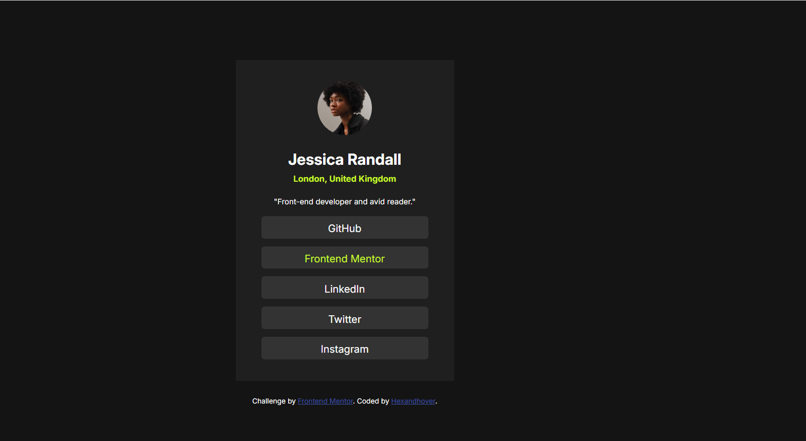

# Frontend Mentor - Social links profile solution

This is a solution to the [Social links profile challenge on Frontend Mentor](https://www.frontendmentor.io/challenges/social-links-profile-UG32l9m6dQ). Frontend Mentor challenges help you improve your coding skills by building realistic projects. 

## Table of contents
  - [The challenge](#the-challenge)
  - [Screenshot](#screenshot)
  - [Links](#links)
  - [My process](#my-process)
  - [Built with](#built-with)
  - [What I learned](#what-i-learned)
  - [Continued development](#continued-development)
  - [Author](#author)

### The challenge

Users should be able to:

- See hover and focus states for all interactive elements on the page

### Screenshot

### Links

- Solution URL: [Add solution URL here](https://your-solution-url.com)
- Live Site URL: [Add live site URL here](https://your-live-site-url.com)

## My process
  IT'S FINALLY DONE!
  ı HATE CENTERING STUFF

### Built with

- Semantic HTML5 markup
- CSS custom properties
- Flexbox

### What I learned
  I am starting to get more why something happening and not just trying everything till it wokrs.

### Continued development
  my sanity

## Author

- Frontend Mentor - [@hexandhover](https://www.frontendmentor.io/profile/hexandhover)
- Twitter - [@CrimsonEdition](https://x.com/CrimsonEdition)
- Github - [@hexandhover](https://github.com/hexandhover)

